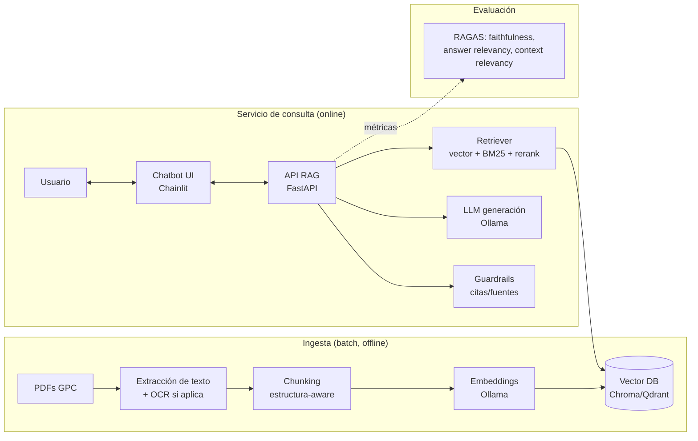

# Guía de implementación — RAG on-premise para Guías de Práctica Clínica (GPC)

**Contexto:** Sistema de recuperación semántica RAG para consultar Guías de Práctica Clínica en la Clínica Universitaria Bolivariana (CUB). Debe ser 100% on-premise (Ley 1581/2012, Resolución 1995/1999), sin costos de LLM ni de base de datos, expuesto a usuarios finales como un chatbot, y con una ruta clara de POC → producción en Docker.

Repo base: `JoseRZapata/data-science-project-template` (uv, ruff, mypy, pytest, Hydra, MkDocs, GitHub Actions, pre-commit, Cruft).

---

## 1. Respuesta directa: ¿un POC se puede mover a Docker después?

Sí, sin problema — siempre que el POC se construya con estas reglas desde el día uno (no hace falta "dockerizar" desde la primera línea de código, pero sí evitar decisiones que luego obliguen a reescribir):

1. **Ollama corre como servicio independiente** (`http://localhost:11434`), nunca importado como librería embebida. El POC ya le habla por HTTP/API, igual que lo hará el contenedor en producción — solo cambia el hostname (`localhost` → `ollama` dentro de la red de Docker Compose).
2. **Toda configuración por variables de entorno** (URLs de Ollama, ruta/URL de la base vectorial, nombre de modelos, `top_k`, etc.), nunca hardcodeada. Usa `.env` + Pydantic Settings o el propio Hydra del template.
3. **La base vectorial también corre como servicio aparte** (Chroma o Qdrant en su propio contenedor, no en memoria del proceso Python), aunque en el POC la levantes con `docker run` suelto en tu laptop.
4. **Separar claramente las capas**: ingesta/indexación (batch, se corre aparte) vs. servicio de consulta (API + chat), para que cada una se pueda contenerizar independientemente.

Si sigues esas 4 reglas, "mover a Docker" se reduce a escribir el `Dockerfile` de tu código (el resto ya corre en contenedores) y un `docker-compose.yml` que orqueste los servicios que ya tenías sueltos. Te dejo esa ruta detallada en la sección 7.

---

## 2. Arquitectura de componentes



Todo corre local: Ollama sirve tanto embeddings como el LLM de generación, y la base vectorial es open-source autoalojada. Cero llamadas salientes a APIs de terceros → cumple el requisito on-premise de tu marco normativo.

---

## 3. Decisiones de stack (y por qué)

### 3.1 Ingesta y OCR
- **Extracción de texto**: `pymupdf4llm` o `unstructured` — ambos preservan estructura (títulos, tablas de recomendaciones, niveles de evidencia) mejor que un `pdfplumber` plano. Para GPC esto importa: las tablas de "nivel de evidencia / grado de recomendación" se pierden fácil si extraes texto crudo.
- **OCR de respaldo**: si algunas guías son escaneadas, agrega `ocrmypdf` (usa Tesseract con modelo `spa`) como paso condicional — detecta si una página tiene capa de texto y si no, la pasa por OCR antes de continuar. Necesito que confirmes si tus GPC son PDF nativo o escaneado para afinar esto; si no lo sabes aún, incluye el paso condicional desde ya, así cubres ambos casos sin sobrecosto cuando no aplica.

### 3.2 Chunking
No uses un splitter de tamaño fijo ciego para documentos clínicos: rompe las recomendaciones a la mitad y separa la recomendación de su nivel de evidencia. Recomendado:
- Chunking **jerárquico por sección** (usa los encabezados extraídos en 3.1 como límites naturales).
- Chunks de ~300–500 tokens con solape de ~15%, pero sin cruzar límites de sección.
- Cada chunk lleva metadata: `guía_origen`, `sección`, `página`, `nivel_evidencia` si aplica. Esto es clave para poder citar la fuente exacta en la respuesta (obligatorio en contexto clínico).

### 3.3 Embeddings (Ollama)
Español + dominio médico → necesitas un modelo multilingüe fuerte, no el `nomic-embed-text` genérico (inglés-céntrico). Opciones disponibles en Ollama, de más liviano a más pesado:

| Modelo | VRAM aprox. | Dimensiones | Notas |
|---|---|---|---|
| `bge-m3` | ~1.2 GB | 1024 (+ sparse/multi-vector) | 100+ idiomas, soporta búsqueda híbrida nativa. Mejor punto de partida. |
| `qwen3-embedding:0.6b` | ~0.6 GB | 1024 | Muy liviano, buen multilingüe si el hardware es limitado. |
| `qwen3-embedding:4b` / `:8b` | ~2.5–5 GB | 4096 | Mejor score MTEB multilingüe si tienes GPU con margen. |

Recomendación: arranca con **`bge-m3`** (buen balance calidad/costo y soporte de búsqueda híbrida) y sube a `qwen3-embedding` solo si las métricas RAGAS no dan la talla.

### 3.4 Base vectorial (gratis, sin SaaS)
- **Chroma**: embebida, cero fricción para el POC, persiste a disco, corre igual en Docker (`chromadb/chroma` image). Suficiente para cientos de guías.
- **Qdrant**: contenedor propio, más robusto para producción real — filtrado de metadata más potente, búsqueda híbrida (denso+sparse) de primera clase, mejor at scale, panel web incluido.

Dado que el objetivo final es producción, te sugiero **empezar directo con Qdrant en Docker** (no cuesta más esfuerzo que Chroma y te ahorras una migración de datos después). Si prefieres iterar más rápido al inicio, Chroma es válido y migras cuando el POC esté validado.

### 3.5 LLM de generación (Ollama)
Depende del hardware, como referencia:

| Escenario | Modelo sugerido |
|---|---|
| GPU 8–12GB VRAM | `llama3.1:8b-instruct` o `qwen2.5:7b-instruct` (buen español) |
| GPU 16GB+ | `qwen2.5:14b-instruct` o `llama3.1:8b` en fp16 sin cuantizar tan agresivo |
| Solo CPU / GPU ≤4GB VRAM | `qwen2.5:3b-instruct` o `llama3.2:3b` cuantizados (Q4) — acepta más latencia |

**Tu equipo de desarrollo** (i5-12450H, 16GB RAM, GPU de 4GB VRAM) cae en la tercera fila: la GPU es demasiado pequeña para correr cómodamente un modelo de 7-8B (un Q4 de 7B ya pesa ~4.5-5GB solo en pesos, sin contar el contexto — se saldría de VRAM y Ollama repartiría entre GPU/CPU, con latencia notable). Para desarrollar y probar el POC en tu máquina:
- **LLM**: `qwen2.5:3b-instruct` o `llama3.2:3b-instruct` — corren bien en CPU+RAM (16GB de sobra) y con algo de aceleración parcial en la GPU de 4GB. `qwen2.5:3b` suele responder mejor en español.
- **Embeddings**: `bge-m3` (~1.2GB) no tiene problema en este equipo.
- Es normal ver 5-15 segundos por respuesta en un 3B en CPU — para el POC/sustentación de tesis es aceptable; si el servidor de producción de CUB tiene GPU con más VRAM, ahí subes a 7-8B sin cambiar código, solo el nombre del modelo en la config de Hydra.

`qwen2.5` suele dar mejor calidad en español que `llama3.1` de tamaño equivalente; vale la pena comparar ambos con tus propias preguntas de prueba antes de decidir. Evita modelos "meditron"/biomédicos entrenados casi solo en inglés — para GPC en español, un buen modelo generalista instruct + RAG bien armado rinde mejor que un modelo médico angloparlante.

### 3.6 Orquestación RAG
No necesitas un framework pesado. Dos caminos válidos:
- **LlamaIndex**: más cómodo si quieres RAG "out of the box" (index, retriever, query engine) con menos código propio.
- **Código propio ligero** (recomendado dado tu perfil de data engineer): un pipeline explícito con LangChain solo para los conectores (Ollama, vector store) pero con la lógica de retrieval/rerank/prompt escrita por ti. Te da control total sobre citación de fuentes y es más fácil de testear con `pytest` (encaja con el template).

Para producción clínica, priorizo control y trazabilidad sobre "menos líneas de código" — inclínate por la segunda opción si el tiempo lo permite.

Retrieval recomendado: **híbrido** (denso + BM25 con `rank_bm25` o el sparse nativo de `bge-m3`) + **reranking** con un cross-encoder ligero (`BAAI/bge-reranker-v2-m3` vía `sentence-transformers`, corre en CPU) antes de pasarle los top-k al LLM. Esto sube notablemente la precisión en GPC, donde muchas recomendaciones usan vocabulario muy similar entre sí.

### 3.7 API
**FastAPI**, encaja de forma natural en `src/` del template (módulo `inference` o uno nuevo `api`). Expón un endpoint `/chat` (o `/query`) que reciba pregunta + historial y devuelva respuesta + fuentes citadas (guía, sección, página).

### 3.8 Chatbot (la interfaz que verán los usuarios)
Dado que el objetivo es que se vea y funcione como un chatbot real:
- **Chainlit** es la opción correcta — está diseñado específicamente para chat conversacional con LLMs (a diferencia de Streamlit, que es para dashboards). Da streaming de tokens, feedback (👍/👎) por respuesta, panel para mostrar fuentes/citas, historial de conversación, y auth opcional — todo con poco código adicional sobre tu API FastAPI.
- Streamlit también podría usarse (más gente lo conoce), pero Chainlit se dockeriza igual de fácil y da mejor experiencia de chat "out of the box" (streaming nativo, threads, citas inline). Recomiendo Chainlit.
- Ambos exponen su propio puerto HTTP y se dockerizan con una imagen `python:3.x-slim` estándar — encaja perfecto en el `docker-compose.yml` de la sección 7.

### 3.9 Evaluación
Ya usas RAGAS en tu marco conceptual — mantenlo también en la implementación: arma un dataset de preguntas-respuesta (idealmente con apoyo de un clínico de CUB) y mide **Faithfulness**, **Answer Relevancy**, **Context Precision/Recall** en cada cambio relevante de pipeline (nuevo modelo, nuevo chunking, etc.). Automatízalo como job en CI o como notebook en `notebooks/8-reports`.

---

## 4. Adaptar el template a este proyecto

1. `pip install cruft` (o `uv tool install cruft`) y genera el proyecto:
   ```bash
   cruft create https://github.com/JoseRZapata/data-science-project-template
   ```
   Esto te deja con `uv`, `ruff`, `mypy`, `pytest`, `pre-commit`, GitHub Actions y MkDocs ya configurados — y con `cruft update` puedes traer mejoras futuras del template sin perder tus cambios.
2. Estructura sugerida dentro de `src/<tu_paquete>/`:
   ```
   src/gpc_rag/
     ingestion/       # extracción PDF, OCR, chunking
     embeddings/       # cliente Ollama embeddings
     vectorstore/      # cliente Qdrant/Chroma
     retrieval/        # búsqueda híbrida + reranking
     generation/        # prompts + cliente Ollama LLM
     api/              # FastAPI (routers, schemas)
     chat/             # app Chainlit
     evaluation/       # RAGAS
   conf/               # Hydra: configs de modelos, chunking, retrieval por ambiente
   ```
3. `pyproject.toml`: agrega dependencias vía `uv add fastapi chainlit qdrant-client ollama pymupdf4llm rank-bm25 sentence-transformers ragas` (ajusta según lo que decidas).
4. Aprovecha `conf/` (Hydra) para tener configs distintas por ambiente: `conf/dev.yaml` apuntando a Ollama/Qdrant locales, `conf/docker.yaml` apuntando a los nombres de servicio de Compose.

---

## 5. Roadmap por fases (alineado a tu metodología CRISP-DM)

**Fase 0 — Setup (1 semana)**
- Generar repo desde el template, configurar `uv`, pre-commit, CI básico.
- Levantar Ollama local, descargar `bge-m3` + un LLM candidato, probar con 2-3 GPC de muestra.

**Fase 1 — Ingesta y chunking (1-2 semanas)**
- Pipeline de extracción + chunking estructura-aware para el corpus real de GPC de CUB.
- Indexar en Qdrant/Chroma local.

**Fase 2 — RAG básico + evaluación inicial (1-2 semanas)**
- Retriever denso simple + generación con citas de fuente.
- Primer dataset de evaluación RAGAS con preguntas reales (idealmente validadas por un clínico).

**Fase 3 — Mejora de retrieval (1-2 semanas)**
- Híbrido (denso+BM25) + reranking. Reevaluar con RAGAS, comparar contra la línea base de Fase 2.

**Fase 4 — Chatbot (Chainlit) + API (1 semana)**
- Exponer FastAPI, conectar Chainlit, feedback de usuarios, mostrar fuentes citadas.

**Fase 5 — POC funcional para sustentación**
- Todo corriendo local (sin Docker aún si no da el tiempo), demo con usuarios piloto de CUB.

**Fase 6 — Dockerización y despliegue**
- `Dockerfile` + `docker-compose.yml` (sección 7), pruebas de humo en el servidor destino, documentación operativa (MkDocs del template).

---

## 6. Cumplimiento normativo (Ley 1581/2012, Resolución 1995/1999)

- Ningún dato ni documento sale del perímetro on-premise: Ollama, la base vectorial y la API corren en infraestructura de la CUB — nunca llames a OpenAI/Anthropic/etc. como fallback "por si acaso", eso rompería el argumento central de la tesis.
- Registra en el pipeline de ingesta el origen y versión de cada GPC (trazabilidad documental).
- Si en algún punto conectas historia clínica o datos de pacientes (no solo las guías), ahí sí aplican controles adicionales de datos sensibles de salud — pero para el alcance actual (consultar el contenido de las GPC, no datos de pacientes) el riesgo es menor.

---

## 7. Docker (para cuando pases de POC a producción)

`docker-compose.yml` (esqueleto):

```yaml
services:
  ollama:
    image: ollama/ollama:latest
    volumes:
      - ollama_data:/root/.ollama
    ports:
      - "11434:11434"
    deploy:
      resources:
        reservations:
          devices:
            - driver: nvidia
              count: 1
              capabilities: [gpu]   # quita este bloque si es solo CPU

  qdrant:
    image: qdrant/qdrant:latest
    volumes:
      - qdrant_data:/qdrant/storage
    ports:
      - "6333:6333"

  api:
    build: ./
    depends_on:
      - ollama
      - qdrant
    environment:
      - OLLAMA_URL=http://ollama:11434
      - QDRANT_URL=http://qdrant:6333
    ports:
      - "8000:8000"

  chat:
    build: ./
    command: chainlit run src/gpc_rag/chat/app.py --host 0.0.0.0
    depends_on:
      - api
    environment:
      - API_URL=http://api:8000
    ports:
      - "8001:8001"

volumes:
  ollama_data:
  qdrant_data:
```

Notas:
- Un único `Dockerfile` (basado en `python:3.12-slim` + `uv`) puede servir tanto para `api` como para `chat`, solo cambia el `command`.
- Descarga de modelos: en el primer arranque hay que hacer `docker exec ollama ollama pull bge-m3` y `docker exec ollama ollama pull qwen2.5:7b-instruct` (o automatizarlo con un script de init).
- Para exponerlo fuera del servidor con HTTPS, agrega un contenedor `nginx` o `traefik` como reverse proxy delante de `chat` (puerto 8001) — no expongas `ollama` ni `qdrant` directamente a internet.
- CI del template (`ci.yml`) ya corre tests y pre-commit; puedes añadir un job de `docker build` para validar que la imagen compila en cada PR.

---

## 8. Pendientes que definen ajustes finos
Para afinar tamaño de modelo y necesidad de OCR, confírmame cuando lo tengas claro:
- Hardware disponible para Ollama (GPU y VRAM, o solo CPU).
- Si las GPC son PDF con texto nativo, escaneadas, o una mezcla.
- Volumen aproximado de guías a indexar inicialmente.

Con esos tres datos ajusto la tabla de modelos y decido si Chroma es suficiente o si vale la pena ir directo con Qdrant.
